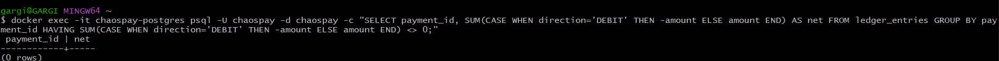

# ChaosPay

Fault-tolerant payment gateway with idempotency, double-entry ledger,
retry + circuit breaker, and reconciliation.

## Run

    docker-compose up -d
    mvn spring-boot:run

## Test

    curl -X POST http://localhost:8080/api/v1/payments \
      -H "Content-Type: application/json" \
      -H "Idempotency-Key: test-001" \
      -d '{"fromAccount":"11111111-1111-1111-1111-111111111111","toAccount":"22222222-2222-2222-2222-222222222222","amount":10000,"currency":"INR"}'

## Stack

Java 17, Spring Boot 3.2, PostgreSQL, Redis, Resilience4j, Docker

##  Resilience Testing (Chaos Engineering)

ChaosPay was tested against a simulated external payment processor with a 20% failure rate. Under a load of 50 concurrent requests, the system's Resilience4j Circuit Breaker demonstrated self-healing behavior.

### 1. Circuit Breaker Tripping
When the failure rate reached 50%, the circuit transitioned to `OPEN`, immediately fast-failing 42 subsequent requests to the Dead Letter Queue (DLQ) without calling the failing processor.

### 2. Ledger Integrity Under Chaos
Despite 42 failed transactions (DLQ), the double-entry ledger remained perfectly balanced. The reconciliation job reported `0 mismatches`.

