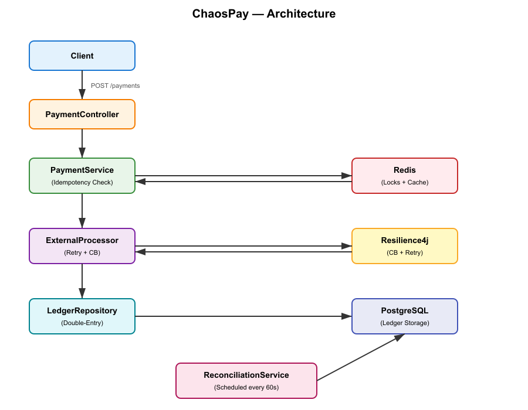
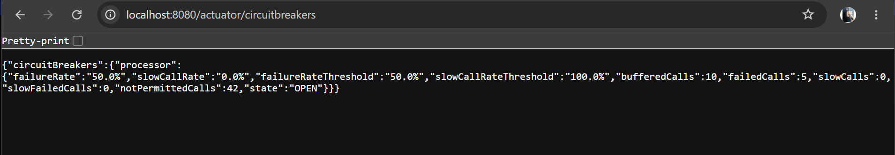

# ChaosPay — Fault-Tolerant Payment Gateway

A production-inspired payment backend that guarantees **exactly-once execution** under network failures, service crashes, and retries. Built with Java 17, Spring Boot, PostgreSQL, and Redis.


---

## 🎯 Problem Statement

Payment systems must handle four hard problems:

- **Duplicate requests** — user clicks "Pay" twice by accident
- **Network failures** — external processor times out mid-transaction
- **Cascading failures** — one slow service brings down the whole system
- **Data integrity** — money must never be created or destroyed

ChaosPay solves all four using battle-tested distributed systems patterns.

---

## 🏗️ Architecture




### Core Components

| Component | Responsibility | Tech |
|-----------|---------------|------|
| **Payment API** | REST endpoint with idempotency | Spring Web |
| **Idempotency Layer** | Prevents double-charges | Redis (SETNX) + DB constraint |
| **Payment Service** | Orchestrates flow + state machine | Spring Service |
| **Ledger** | Double-entry accounting | PostgreSQL |
| **Circuit Breaker** | Prevents cascading failures | Resilience4j |
| **Reconciliation Job** | Verifies ledger integrity | Spring Scheduling |

---

## 🚀 Quick Start

### Prerequisites
- Java 17+
- Maven 3.9+
- Docker Desktop

### Run

```bash
# 1. Start Postgres and Redis
docker-compose up -d

# 2. Run the app
mvn spring-boot:run

# 3. Test it
curl -X POST http://localhost:8080/api/v1/payments \
  -H "Content-Type: application/json" \
  -H "Idempotency-Key: test-001" \
  -d '{
    "fromAccount": "11111111-1111-1111-1111-111111111111",
    "toAccount": "22222222-2222-2222-2222-222222222222",
    "amount": 10000,
    "currency": "INR"
  }'
```

---

## 🧪 Chaos Engineering Test Results

ChaosPay was load-tested with **50 concurrent requests** against a simulated external processor with a **20% failure rate**.

### Circuit Breaker Behavior

When the failure rate crossed 50%, the circuit transitioned to `OPEN`:

```json
{
  "circuitBreakers": {
    "processor": {
      "failureRate": "50.0%",
      "state": "OPEN",
      "bufferedCalls": 10,
      "failedCalls": 5,
      "notPermittedCalls": 42
    }
  }
}
```

**Impact:** 42 requests were **fast-failed** to the Dead Letter Queue (DLQ) without ever hitting the failing processor — preventing cascading failure.



### Ledger Integrity Under Chaos

Despite 42 failed transactions, the double-entry ledger remained perfectly balanced:

```sql
SELECT payment_id,
       SUM(CASE WHEN direction='DEBIT' THEN -amount ELSE amount END) AS net
FROM ledger_entries
GROUP BY payment_id
HAVING SUM(CASE WHEN direction='DEBIT' THEN -amount ELSE amount END) <> 0;
-- Result: 0 rows (perfect balance)
```

The reconciliation job reported **0 mismatches** across all runs.


---

## 📊 Metrics

| Metric | Target | Achieved |
|--------|--------|----------|
| Double-charge rate | 0% | ✅ 0% |
| Ledger balance | 100% | ✅ 100% |
| Circuit breaker recovery | < 30s | ✅ 30s (configurable) |

---

## 🔧 Design Decisions

### Why Redis + DB for Idempotency?
- **Redis** — sub-millisecond lookup for fast rejection
- **DB unique constraint** — durable, survives Redis restart
- **Defense in depth** — both layers must agree before processing

### Why Circuit Breaker Over Just Retries?
- **Retries** handle transient failures (network blips, brief timeouts)
- **Circuit breaker** prevents hammering a dying service — it protects the *whole system* from cascading failure

### Why Double-Entry Ledger?
- **Accounting integrity** — every transaction has one debit and one credit
- **Auditability** — full immutable history
- **Balance verification** — `SUM(entries) = 0` always

---

## 📁 Project Structure

```
chaospay/
├── src/main/java/com/chaospay/
│   ├── controller/       # REST endpoints
│   ├── service/          # Business logic
│   │   ├── PaymentService.java
│   │   ├── IdempotencyService.java
│   │   ├── ExternalProcessorClient.java
│   │   └── ReconciliationService.java
│   ├── domain/           # Entities
│   ├── repository/       # Data access
│   └── exception/        # Error handling
├── src/main/resources/
│   ├── application.yml
│   ├── schema.sql
│   └── data.sql
├── docs/                 # Diagrams, screenshots
└── docker-compose.yml
```

---

## 🛠️ Tech Stack

- **Java 17** — LTS, records, pattern matching
- **Spring Boot 3.2** — Web, Data JPA, Actuator
- **PostgreSQL 16** — ACID transactions, ledger storage
- **Redis 7** — Idempotency cache, distributed locks
- **Resilience4j 2.2** — Circuit breaker, retry
- **Docker** — Reproducible environments

---

## 📝 License

MIT License — see [LICENSE](LICENSE)

---

## 👤 Author

**Gargi Vijay** — [GitHub](https://github.com/gargivijay94)
